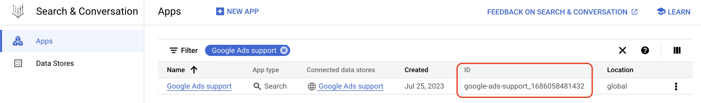

# Generative AI for Marketing using Google Cloud

This repository provides a deployment guide showcasing the application of Google Cloud's Generative AI for marketing scenarios. It offers detailed, step-by-step guidance for setting up and utilizing the Generative AI tools, including examples of their use in crafting marketing materials like blog posts and social media content.

Additionally, supplementary Jupyter notebooks are provided to aid users in grasping the concepts explored in the demonstration.

The architecture of all the demos that are implemented in this application is as follows.    


## Repository structure

```
.
├── app
└── backend_apis
└── frontend
└── notebooks
└── templates
└── installation_scripts
└── tf
```

- [`/app`](/app): Architecture diagrams.  
- [`/backend_apis`](/backend_apis): Source code for backend APIs.  
- [`/frontend`](/frontend): Source code for the front end UI.  
- [`/notebooks`](/notebooks): Sample notebooks demonstrating the concepts covered in this demonstration.  
- [`/templates`](/templates): Workspace Slides, Docs and Sheets templates used in the demonstration.  
- [`/installation_scripts`](/installation_scripts): Installation scripts used by Terraform.  
- [`/tf`](/tf): Terraform installation scripts.


## Demonstrations

In this repository, the following demonstrations are provided:  

* **Marketing Insights**: Utilize Looker Dashboards to access and visualize marketing data, powered by Looker dashboards, marketers can access and visualize marketing data to build data driven marketing campaigns. These features can empower businesses to connect with their target audience more efficiently, thereby improving conversion rates.  
* **Audience and Insight finder**: Conversational interface that translates natural language into SQL queries. This democratizes access to data for non-SQL users removing any bottleneck for marketing teams.  
* **Trendspotting**: Identify emerging trends in the market by analyzing Google Trends data on a Looker dashboard and summarize news related to top search terms. This can help businesses to stay ahead of the competition and to develop products and services that meet the needs and interests of their customers.  
* **Content Search**: Improve search experience for internal or external content with Vertex AI Search for business users.  
* **Content Generation**: Reduce time for content generation with Vertex Foundation Models. Generate compelling and captivating email copy, website articles, social media posts, and assets for PMax. All aimed at achieving specific goals such as boosting sales, generating leads, or enhancing brand awareness. This encompasses both textual and visual elements using Vertex language & vision models.  
* **Workspace integration**: Transfer the insights and assets you've generated earlier to Workspace and visualize in Google Slides, Docs and Sheets.


## Notebooks and code samples

The notebooks listed below were developed to explain the concepts exposed in this repository:  
- [Getting Started](/notebooks/1_environment_setup.ipynb) (1_environment_setup.ipynb): This notebook is part of the deployment guide and helps with dataset preparation.
- [Data Q&A with PaLM API and GoogleSQL](/notebooks/data_qa_with_sql.ipynb) (data_qa_with_sql.ipynb): Translate questions using natural language to GoogleSQL to interact with BigQuery.
- [News summarization with LangChain agents and Vertex AI PaLM text models](/notebooks/news_summarization_langchain_palm.ipynb) (news_summarization_langchain_palm.ipynb): Summarize news articles related to top search terms using LangChain agents and the ReAct concept.
- [News summarization with PaLM API](/notebooks/simple_news_summarization.ipynb) (simple_news_summarization.ipynb): News summarization related to top search terms using the PaLM API.
- [Imagen fine tuning](/notebooks/Imagen_finetune.ipynb) (Imagen_finetune.ipynb): Fine tune Imagen model.

The following additional (external) notebooks provide supplementary information on the concepts discussed in this repository:
- [Tuning and deploy a foundation model](https://github.com/GoogleCloudPlatform/generative-ai/blob/main/language/tuning/tuning_text_bison.ipynb): This notebook demonstrates how to tune a model with your dataset to improve the model's response. This is useful for brand voice because it allows you to ensure that the model is generating text that is consistent with your brand's tone and style.
- [Document summarization techniques](https://github.com/GoogleCloudPlatform/generative-ai/tree/main/language/use-cases/document-summarization): Two notebooks explaining different techniques to summarize large documents.
- [Document Q&A](https://github.com/GoogleCloudPlatform/generative-ai/tree/main/language/use-cases/document-qa): Two notebooks explaining different techniques to do document Q&A on a large amount of documents.
- [Vertex AI Search - Web search](https://github.com/GoogleCloudPlatform/generative-ai/tree/main/search/web-app): This demo illustrates how to search through a corpus of documents using Vertex AI Search. Additional features include how to search the public Cloud Knowledge Graph using the Enterprise Knowledge Graph API.
- [Vertex AI Search - Document search](https://github.com/GoogleCloudPlatform/generative-ai/tree/main/search/retrieval-augmented-generation): This demo illustrates how Vertex AI Search and the Vertex AI PaLM API help ensure that generated content is grounded in validated, relevant and up-to-date information.
- [Getting Started with LangChain and Vertex AI PaLM API](https://github.com/GoogleCloudPlatform/generative-ai/blob/main/language/orchestration/langchain/intro_langchain_palm_api.ipynb): Use LangChain and Vertex AI PaLM API to generate text.


# Environment Setup

This section outlines the steps to configure the Google Cloud environment that is required in order to run the code provided in this repository.  
You will be interacting with the following resources:
 - BigQuery is utilized to house data from Marketing Platforms, while Dataplex is employed to keep their metadata.  
 - Vertex AI Search & Conversation - are used to construct a search engine for an external website.  
 - Workspace (Google Slides, Google Docs and Google Sheets) are used to visualized the resources generated by you.


### 1- Select a Google Cloud project

In the Google Cloud Console, on the project selector page, [select or create a Google Cloud project](https://console.cloud.google.com/projectselector2).  
> **As this is a DEMONSTRATION, you need to be a project owner in order to set up the environment.**


### 2- Enable the required services

From [Cloud Shell](https://cloud.google.com/shell/docs/using-cloud-shell), run the following commands to enable the required Cloud APIs.  
Replace `<CHANGE TO YOUR PROJECT ID>` to the id of your project and `<CHANGE TO YOUR LOCATION>` to the location where your resources will be deployed.

```bash
export PROJECT_ID=<CHANGE TO YOUR PROJECT ID>  
export LOCATION=<CHANGE TO YOUR LOCATION>  
gcloud config set project $PROJECT_ID  
```

Enable the services:

```bash 
gcloud services enable \
  run.googleapis.com \
  cloudbuild.googleapis.com \
  compute.googleapis.com \
  cloudresourcemanager.googleapis.com \
  iam.googleapis.com \
  container.googleapis.com \
  cloudapis.googleapis.com \
  cloudtrace.googleapis.com \
  containerregistry.googleapis.com \
  iamcredentials.googleapis.com \
  secretmanager.googleapis.com \
  firebase.googleapis.com

gcloud services enable \
  monitoring.googleapis.com \
  logging.googleapis.com \
  notebooks.googleapis.com \
  aiplatform.googleapis.com \
  storage.googleapis.com \
  datacatalog.googleapis.com \
  appengineflex.googleapis.com \
  translate.googleapis.com \
  admin.googleapis.com \
  docs.googleapis.com \
  drive.googleapis.com \
  sheets.googleapis.com \
  slides.googleapis.com \
  firestore.googleapis.com
```

### 3- In Cloud Shell, authenticate with your account and set Quota Project
From Cloud Shell, execute the following commands:

 - Set your project id. Replace `<CHANGE TO YOUR PROJECT ID>` with your project ID.
```bash 
export PROJECT_ID=<CHANGE TO YOUR PROJECT ID>
```

 - Follow the instructions in your Shell to authenticate with the same user that has EDITOR/OWNER rights to this project.
> gcloud auth application-default login

 - Set the Quota Project
> gcloud auth application-default $PROJECT_ID


### 4- Clone the Gen AI for Marketing repository
From Cloud Shell, execute the following command:

> git clone https://github.com/GoogleCloudPlatform/genai-for-marketing  


### 5- Update the configuration with information of your project

Open the [configuration file](/backend_apis/app/config.toml) and include your project id (line 16) and location (line 17).


### 6- Prepare BigQuery and Dataplex
From Cloud Shell, navigate to [/installation_scripts](/installation_scripts) and execute the following command.  
Make sure you have set the environmental variables PROJECT_ID and LOCATION.  
> cd ./genai-for-marketing/installation_scripts  
> pip3 install -r requirements.txt  

Run the python script to create the BigQuery dataset and the DataCatalog TagTemplate.  
> python3 1_env_setup_script.py  


### 7- Create an Vertex AI Search engine for a public website

Follow the steps below to create a search engine for a website using Vertex AI Search.
 - Make sure the Vertex AI Search APIs are enabled [here](https://cloud.google.com/generative-ai-app-builder/docs/try-enterprise-search#before-you-begin) and you activated Vertex AI Search [here](https://cloud.google.com/generative-ai-app-builder/docs/try-enterprise-search#activate).  
 - Create and preview the website search engine as described [here](https://cloud.google.com/generative-ai-app-builder/docs/try-enterprise-search#create_a_search_app_for_website_data) and [here](https://cloud.google.com/generative-ai-app-builder/docs/try-enterprise-search#preview_your_app_for_website_data).

After you finished creating the Vertex AI Search datastore, navigate back to the [`Apps`](https://console.cloud.google.com/gen-app-builder/engines) page and copy the ID of the datastore you just created.  
Example:  


Open the [configuration file - line 33](/backend_apis/app/config.toml) and include the datastore ID. 
**Don't forget to save the configuration file.**

**Important**: If you don't have access to the DNS of the website to verify the domain, you can use a Search Engine with PDFs (for example) to enable the Advanced Features.

### 8- Add your Looker Dashboards

In order to render your Looker Dashboards in the UI, you need to update a HTML file with links to them.

1) Open this [HTML file - lines 18 and 28](/frontend/src/app/marketing-insights/marketing-insights.component.html) and include links to the Looker dashboards for Marketing Insights.  

2) Open this [HTML file - lines 27 and 37](/frontend/src/app/campaign-performance/campaign-performance.component.html) and include links to the Looker dashboards for Campaign Performance.

The `allow_login_screen=true` in the URL will open the authentication page from Looker to secure the access to your account.

**[Optional]** If you have your Google Ads and Google Analytics 4 accounts in production, you can deploy the [`Marketing Analytics Jumpstart`](https://github.com/GoogleCloudPlatform/marketing-analytics-jumpstart) solution to your project, build the Dashboards and link them to the demonstration UI.  


### 9- Create a Generative AI DataStore Agent

Next you will create a Generative AI Agent that will assist the users to answer questions about Google Ads, etc.  
- Follow the steps described in this [Documentation](https://cloud.google.com/dialogflow/vertex/docs/concept/data-store-agent) to build your own Datastore Agent.  
  - Execute these steps in the same project you will deploy this demo.  
- Enable [Dialogflow Messenger integration](https://cloud.google.com/dialogflow/cx/docs/concept/integration/dialogflow-messenger) and copy the `project-id` and `agent-id` from the HTML code snippet provided by the platform.  
  - The HTML code snippet looks like this: 
    
- Open the [HTML file - line 117](/frontend/src/app/home/home.component.html) and replace the variables with the `project-id` and `agent-id`.  


### 10- Workspace integration

Follow the steps below to setup the Workspace integration with this demonstration.


#### 10.1- Create a service account and upload the content to Secret Manager
- Create a Service Account (SA) in the same project you are deploying the demo and download the JSON API Key. This SA doesn't need any roles / permissions.  
  - Follow this [documentation](https://cloud.google.com/iam/docs/service-accounts-create) to create the service account. Take note of the service account address; it will look like this: `name-of-the-sa@my-project.iam.gserviceaccount.com`.
  - Follow this [documentation](https://cloud.google.com/iam/docs/keys-create-delete#creating) to download the key JSON file with the service account credentials.  
- Upload the content of this Service Account to a Secret in Google Cloud Secret Manager.
  - Follow the steps in the [documentation](https://cloud.google.com/secret-manager/docs/create-secret-quickstart) to accomplish that
  - Open the [configuration file - line 21](/backend_apis/app/config.toml) and replace with the full path to your Secret in Secret Manager.

> **IMPORTANT**: For security reasons, DON'T push this credentials to a public Github repository.


#### 10.2- Change the DOMAIN that folders will be shared with
This demonstration will create folders under Google Drive, Google Docs documents, Google Slides presentations and Google Sheets documents.  
When we create the Drive folder, we set the permission to all users under a specific domain.

 - Open [config.toml - line 59](/backend_apis/app/config.toml) and change to the domain you want to share the folder (example: mydomain.com).
   - This is the same domain where you have Workspace set up.

Be aware that this configuration will share the folder with all the users in that domain.  
If you want to change that behavior, explore different ways of sharing resources from this documentation:  
https://developers.google.com/drive/api/reference/rest/v3/permissions#resource:-permission


#### 10.3- Google Drive
 - Navigate to [Google Drive](https://drive.google.com/) and create a folder.  
   - This folder will be used to host the templates and assets created in the demo.
 - Share this folder with the service account address you created in the previous step. Give "Editor" rights to the service account. The share will look like this:

 - Take note of the folder ID. Go into the folder you created and you will be able to find the ID in the URL. The URL will look like this:
 
 - Open the configuration file [app_config.toml - line 39](/backend_apis/app/config.toml) and change to your folder ID.
 - **IMPORTANT**: Also share this folder with people who will be using the code.


#### 10.4- Google Slides, Google Docs and Google Sheets
 - Copy the content of [templates](/templates) to this newly created folder.
 - For the Google Slides template (`[template] Marketing Assets`): 
   - From the Google Drive folder open the file in Google Slides.  
   - In Google Slides, click on `File` and `Save as Google Slides`. Take note of the Slides ID from the URL.
   - Open the configuration file [app_config.toml - line 40](/backend_apis/app/config.toml) and change to your Slides ID.
 - For the Google Docs template (`[template] Gen AI for Marketing Google Doc Template`): 
   - From the Google Drive folder open the file in Google Docs. 
   - In Google Docs, click on `File` and `Save as Google Docs`. Take note of the Docs ID from the URL.
   - Open the configuration file [app_config.toml - line 41](/backend_apis/app/config.toml) and change to your Docs ID.
 - For the Google Sheets template (`[template] GenAI for Marketing`):  
   - From the Google Drive folder open the Google Sheets.
   - In Google Sheets, click in `File` and `Save as Google Sheets`. Take note of the Sheets ID from the URL.
   - Open the configuration file [app_config.toml - line 42](/backend_apis/app/config.toml) and change to your Sheets ID.
 

### 11- Deploy the APIs to Cloud Run and Firebase Hosting

#### 11.1- Cloud Run
 - Navigate to the [/backend_apis](`genai-for-marketing/backend_apis/`) folder  

> cd ./genai-for-marketing/backend_apis/  

 - Open the [Dockerfile - line 20](/backend_apis/Dockerfile) and include your project id where indicated.
 - Build and deploy the Docker image to Cloud Run.  

> gcloud run deploy genai-marketing --source . --region us-central1 --allow-unauthenticated

- Open the [Typescript file - line 2](/frontend/src/environments/environments.ts) and include the URL to your newly created Cloud Run deployment.  
Example: `https://marketing-image-tlmb7xv43q-uc.a.run.app`  

#### 11.2- Firebase Hosting

**Enable Firebase**
 - Go to https://console.firebase.google.com/
 - Select "Add project" and enter your GCP project id. Make sure it is the same project you deployed the resources so far.
 - Add Firebase to one of your existing Google Cloud projects
 - Confirm Firebase billing plan
 - Continue and complete the configuration


#### 11.3- Firebase Hosting app setup
After you have a Firebase project, you can register your web app with that project.

In the center of the Firebase console's project overview page, click the Web icon (plat_web) to launch the setup workflow.

If you've already added an app to your Firebase project, click Add app to display the platform options.
 - Enter your app's nickname.
 - This nickname is an internal, convenience identifier and is only visible to you in the Firebase console.
 - Click Register app.
 - Copy the information to include in the configuration.

Open the [frontend environment file - line 3](/frontend/src/environments/environments.ts) and include the Firebase information.

#### 11.4- Build Angular Frontend
Angular is the framework for the Frontend. Execute the following commands to build your application.

```bash
npm install -g @angular/cli  
npm install --legacy-peer-deps  

cd ./genai-for-marketing/frontend  

ng build  
```

#### 11.5- Firebase Hosting Setup
Firebase Hosting is used to serve the frontend.

 - Install firebase tools
```bash
npm install -g firebase-tools  

firebase login --no-localhost  
```
Follow the steps presented in the console to login to Firebase.

 - Init hosting
```bash
cd frontend/dist/frontend  

firebase init hosting
```
First type your Firebase project and then type `browser` as the public folder.  
Leave the defaults for the rest of the questions.

 - Deploy hosting
```bash
firebase deploy --only hosting
```
Navigate to the created URL to access the Gen AI for Marketing app.


#### 11.6- Firestore database setup

Visit the following URL to create a database for Firestore.  
Replace `your-project-id` with your project ID.

https://console.cloud.google.com/datastore/setup?project=your-project-id
 - Choose "Native Mode (Recommended)" for the database mode.
 - Click Save


#### 11.7- Enable Firebase Authentication with Google

Visit the following URL to enable Firebase Authentication.  
Replace `your-project-id` with your project ID.
https://firebase.corp.google.com/project/your-project-id/authentication/providers

 - Add a new provider by clicking on "Add new provider"
 - Choose "Google" and click "enable" and then "Save".


## Getting help

If you have any questions or if you found any problems with this repository, please report through GitHub issues.
