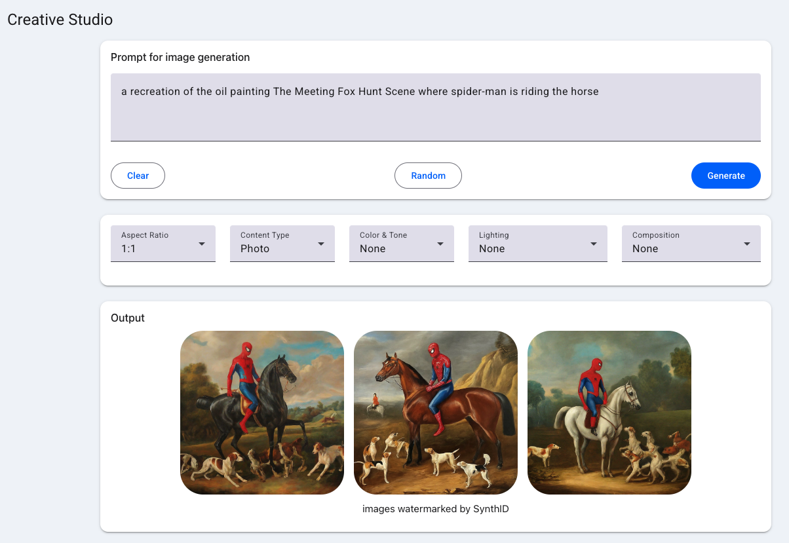

# Gen Media | Creative Studio | Vertex AI

Creative Studio is an app that highlights the capabilities of Google Cloud Vertex AI generative AI creative APIs, including Imagen, the text-to-image model, for marketing and creative teams.

This app is built with [Mesop](https://google.github.io/mesop), an unofficial Google Python UX framework.


## Imagen | Creative Studio




## Run locally

## Prerequisites

* a Google Cloud Project
* a Google Cloud Storage bucket

Provide an environment variable for your Google Cloud Project ID

```
export PROJECT_ID=$(gcloud config get project)
```

Provide a Google Cloud Storage bucket for the generative media, without the `gs://` url prefix, for example: 

```
export GENMEDIA_BUCKET=myproject-genmedia/temp/
```

### Install requirements

```
python3 -m venv venv
. venv/bin/activate
pip install -r requirements.txt
```


### Run with mesop

```
mesop main.py
```


## Deploy to Cloud Run

To deploy to Cloud Run, make sure to include the environment variables in the prerequisites section.

```
gcloud run deploy creative-studio --source . --allow-unauthenticated --region us-central1 \
  --update-env-vars=GENMEDIA_BUCKET=$GENMEDIA_BUCKET,PROJECT_ID=$PROJECT_ID
```

It's recommended that you create a separate service account to deploy a Cloud Run Service.

